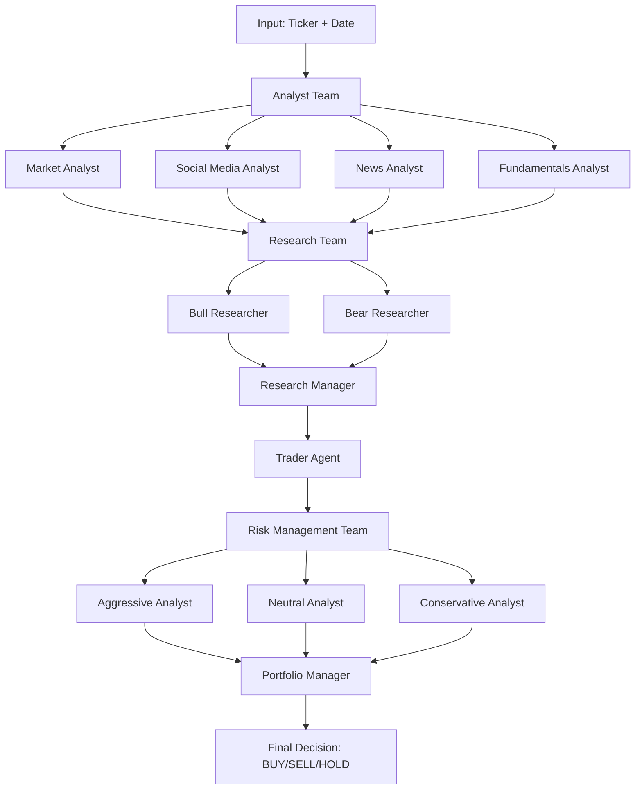

# 📊 TradeGuide AI - Intelligent Trading Platform

This document provides a comprehensive overview of the AI-Powered Stock Analysis and CandleStick Chart project.

---

## 🎯 Project Overview

This is a **Streamlit-based AI Investment Dashboard** that provides three core modules for investors and traders:

1. **Investment Plan App** - AI-driven investment recommendations
2. **Technical Analysis App** - Stock analysis with candlestick charts and indicators
3. **TradingAgents Framework** - Multi-agent AI trading system

---

## 📁 Project Structure

```
AI-Powered-Stock-Analysis-and-CandleStick-Chart-main/
├── Home Page.py                    # Main entry point - TradingAgents UI
├── Trading Agent.py                # Standalone TradingAgents page
├── pages/                          # Streamlit multi-page app structure
│   ├── Candle Stick Chart.py       # Candlestick chart visualization
│   ├── Investment_Strategist.py    # AI-powered investment recommendations
│   ├── Technical_Analysis.py       # Technical indicators dashboard
│   ├── Strategy_Developer.py       # Strategy development & win rate tracking
│   └── trading_coach.py            # Real-time price fetching
├── TradingAgents/                  # Multi-agent trading framework (local copy)
│   └── tradingagents/
│       ├── agents/                 # AI agents (analysts, researchers, etc.)
│       ├── dataflows/              # Data fetching and processing
│       ├── graph/                  # LangGraph workflow orchestration
│       └── default_config.py       # Framework configuration
├── utils/
│   └── data_vendor.py              # Unified data vendor interface
├── requirements.txt                # Python dependencies
├── .env.example                    # Environment variables template
└── README.markdown                 # Project documentation
```

---

## 🔑 Key Components

### 1. Home Page.py (814 lines)
The **main entry point** - a Streamlit app that provides the TradingAgents interface.

**Key Features:**
- LLM Provider selection (Google Gemini, OpenRouter, Groq)
- Data vendor selection (Yahoo Finance, Alpha Vantage)
- Stock/Crypto/Forex ticker selection with popular presets
- Date range selection with automatic chunking for large ranges
- Analyst team selection (Market, Social, News, Fundamentals)
- Research depth configuration (1-5 debate rounds)
- Model selection (Quick-thinking and Deep-thinking models)
- Results displayed in tabs: Analyst Reports, Research Team, Trading Plan, Risk Assessment, Final Decision

---

### 2. Pages Directory

#### 📈 Candle Stick Chart.py (347 lines)
Interactive candlestick chart visualization using Bokeh.

**Features:**
- S&P 500 company selection from Wikipedia
- Multiple timeframe support (1d, 1h, 30m)
- Technical indicators via TA-Lib (SMA, EMA, RSI, MACD, etc.)
- Candlestick pattern detection (Doji, Hammer, Engulfing)
- Price alerts with visual markers
- Multi-stock comparison with normalized prices
- Performance metrics and SMA crossover backtesting
- Financial metrics display (P/E, Market Cap, Dividend Yield)

#### 📊 Investment_Strategist.py (244 lines)
AI-powered investment recommendations using **Agno framework** with Gemini models.

**Agents:**
- **Market Analyst** - Compares stock performance over 6 months
- **Company Researcher** - Fetches company profiles and news
- **Stock Strategist** - Provides investment insights
- **Team Lead** - Aggregates all analyses into final report

**Output Format:**
- Company analysis with SWOT
- Fundamentals (P/E, Revenue Growth, Debt-to-Equity)
- Investment recommendation (BUY/HOLD/SELL)
- Ranked stock list

#### 📉 Technical_Analysis.py (216 lines)
Technical analysis dashboard using Plotly.

**Features:**
- Candlestick charts with OHLCV data
- SMA with configurable periods
- Bollinger Bands (configurable periods and std dev)
- RSI with overbought/oversold levels
- Volume visualization
- Data export to CSV

#### 🎯 Strategy_Developer.py (1700+ lines)
Comprehensive strategy development and tracking tool.

**Features:**
- Strategy definition (entry/exit rules, stop-loss, take-profit)
- Trade logging with R:R ratio calculation
- **Groq-powered** strategy rephrasing for grammar correction
- **Gemini-powered** chart analysis (uploads chart images for AI analysis)
- **Gemini-powered** strategy compliance analysis
- Win rate calculation with dynamic feedback
- Performance metrics dashboard with Plotly visualizations
- Compliance dashboard with gauge charts and radar charts

#### 💹 trading_coach.py (980 lines)
Real-time price fetching from multiple APIs.

**APIs Supported:**
- Finnhub (primary)
- FCS API (fallback)

**Assets Supported:**
- 40+ US Stocks (Tech, Finance, Healthcare, Consumer, Energy)
- 30+ Cryptocurrencies
- Multiple timeframes (1m, 5m, 15m, 1H, Daily)

---

### 3. TradingAgents Framework

A **LangGraph-based multi-agent system** that simulates a trading firm.

#### Architecture ([trading_graph.py](file:///d:/AI-Powered-Stock-Analysis-and-CandleStick-Chart-main/AI-Powered-Stock-Analysis-and-CandleStick-Chart-main/TradingAgents/tradingagents/graph/trading_graph.py))



**Agent Types:**
| Team | Agents | Purpose |
|------|--------|---------|
| **Analysts** | Market, Social, News, Fundamentals | Gather and analyze data |
| **Researchers** | Bull, Bear | Debate investment thesis |
| **Managers** | Research Manager, Risk Manager | Judge debates |
| **Trader** | Trader Agent | Synthesize insights into plan |
| **Risk Mgmt** | Aggressive, Neutral, Conservative | Evaluate risk tolerance |
| **Portfolio** | Portfolio Manager | Final approval/rejection |

#### Configuration ([default_config.py](file:///d:/AI-Powered-Stock-Analysis-and-CandleStick-Chart-main/AI-Powered-Stock-Analysis-and-CandleStick-Chart-main/TradingAgents/tradingagents/default_config.py))

```python
DEFAULT_CONFIG = {
    "llm_provider": "openrouter",
    "deep_think_llm": "deepseek/deepseek-chat-v3-0324:free",
    "quick_think_llm": "meta-llama/llama-3.3-8b-instruct:free",
    "max_debate_rounds": 1,
    "max_risk_discuss_rounds": 1,
    "data_vendors": {
        "core_stock_apis": "alpha_vantage, yfinance",
        # ... fallback chain configuration
    }
}
```

---

### 4. Data Vendors

#### Supported Sources
| Vendor | API Key Required | Features |
|--------|------------------|----------|
| **Yahoo Finance** | ❌ No | Free, unlimited, reliable |
| **Alpha Vantage** | ✅ Yes (free tier) | Higher quality, 25 req/day |
| **Finnhub** | ✅ Yes (free tier) | Real-time quotes, candles |
| **FCS API** | ✅ Yes (free tier) | Forex, crypto data |

#### Fallback Chain
- Primary: Alpha Vantage
- Fallback: Yahoo Finance
- Auto-switch on rate limits

---

## 🛠️ Technology Stack

| Category | Technologies |
|----------|-------------|
| **Frontend** | Streamlit |
| **Visualization** | Bokeh, Plotly |
| **Data** | yfinance, Alpha Vantage, Finnhub |
| **AI/LLM** | LangChain, LangGraph, Agno |
| **LLM Providers** | Google Gemini, OpenRouter, Groq |
| **Technical Analysis** | TA-Lib, pandas-ta, stockstats |
| **Storage** | ChromaDB (vector memory) |

---

## 📦 Dependencies (requirements.txt)

**Core:**
- `streamlit`, `pandas`, `numpy`

**Visualization:**
- `plotly`, `bokeh`, `cufflinks`

**Data:**
- [yfinance](file:///d:/AI-Powered-Stock-Analysis-and-CandleStick-Chart-main/AI-Powered-Stock-Analysis-and-CandleStick-Chart-main/pages/Candle%20Stick%20Chart.py#61-78), `requests`, `feedparser`

**Technical Analysis:**
- `TA-Lib`, `pandas-ta`, `stockstats`

**AI/LLM:**
- `langchain-openai`, `langchain-google-genai`, `langchain-groq`
- `langgraph`, `agno`, `chromadb`

---

## 🔐 Environment Variables

| Variable | Purpose | Required |
|----------|---------|----------|
| `GOOGLE_API_KEY` | Google Gemini models | For Google provider |
| `OPENROUTER_API_KEY` | OpenRouter models | For OpenRouter provider |
| `GROQ_API_KEY` | Groq Llama models | For Groq provider |
| `ALPHA_VANTAGE_API_KEY` | Premium data | Optional |
| `FINNHUB_API_KEY` | Real-time prices | For trading_coach |
| `FCS_API_KEY` | Forex/crypto data | For trading_coach |

---

## 🚀 How to Run

```bash
# Activate virtual environment
.venv\Scripts\activate

# Run the main dashboard
streamlit run "Home Page.py"

# Open browser at http://localhost:8501
```

---

## 📊 Key Features Summary

1. **Multi-Agent Trading Analysis** - Simulates a full trading firm with debates
2. **Technical Analysis** - Candlestick patterns, indicators (SMA, EMA, RSI, MACD)
3. **AI Investment Recommendations** - BUY/HOLD/SELL signals with rationale
4. **Strategy Development** - Define, track, and analyze trading strategies
5. **Real-Time Prices** - Live stock and crypto price monitoring
6. **Chart Analysis** - Upload charts for AI-powered analysis
7. **Multiple LLM Providers** - Google, OpenRouter, Groq support
8. **Multiple Data Sources** - Yahoo Finance, Alpha Vantage with fallbacks

---

> ⚠️ **Disclaimer**: This project is for educational purposes only. Not recommended for professional trading decisions.
